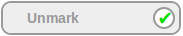

DoneXBlock
==============

Lets a student mark they've finished an activity. The student can
click through two states of the XBlock, shown below:

FutureLearn uses this kind of thing to great effect. Students can read
text, watch videos, etc., and indicate when their done. This is
convenient both for progress indication to the student (know what
they've done, and for honor code grading (indicating to us that they
believe they've finished an activity).

I copied some of the UX patterns from FutureLearn so that users of
both platforms would have consistency of user experience between
MOOCs. I didn't copy them exactly since I wanted to be unambiguously 
in the clear with IP issues around look-and-feel, and this was on a short
anough timeline that I did not have a chance to reach out to
FutureLearn for permission. As a footnote, this kind of collaboration
between MOOC providers is probably worth pursuing -- it'd be to the
benefit of learners on all platforms, and ultimately, the industry as
a whole if we had consistency of experience between platforms where
convenient.
